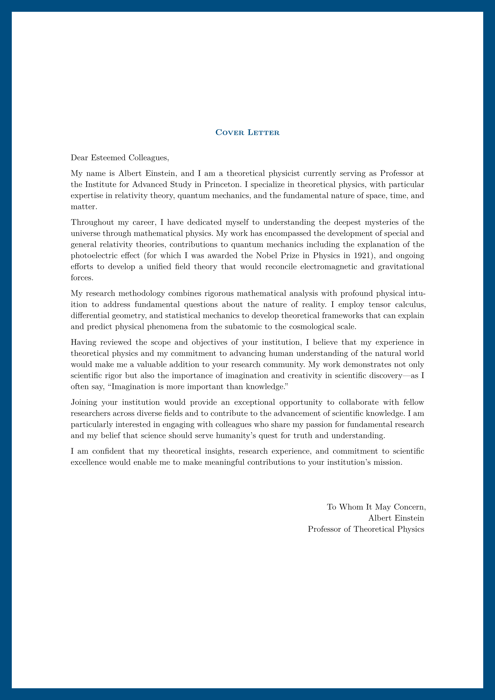

# Formal

This is a template for [Typst](httpss://typst.app) to create formal documents. Currently, it includes templates for a CV, a letter, and a poster.

| CV | Letter | Poster |
|---|---|---|
|  |  |  |

## License

The source code is licensed under [MIT License](LICENSE) and is available on [GitHub repository](https://github.com/vsheg/formal). Templates use the more permissive [MIT-0](https://opensource.org/licenses/MIT-0) license and can be found in the `template/` directory of the repository.
